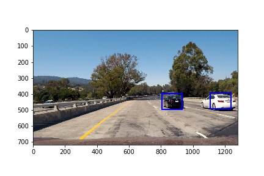

# Project Report and README: Vehicle Detection

### Project Structure
Overview of the different files submitted in the project

1. **`notebook.ipynb`**: IPython notebook which houses all the code
2. **`output_images`**: A folder containing images throughout the project pipeline.
3. **`svc3.pkl`**: Trained LinearSVC model, loaded using pickle
4. **`scaler3.pkl`**: StandardScaler, loaded using pickle 
5. **`classifier2.h5`**: Trained convolutional neural network, loaded using keras
6. **`hog-classifier.h5`**: Trained neural network #2, loaded using keras
7. **`test3.mp4`**: A test video using the final project pipeline

### Project Video Link
Please watch it [here](https://youtu.be/_gABwOYefnc)!

### Solution Design and Approach
**Note**: All the portions mentioned below are within the same python notebook, [notebook.ipynb](notebook.ipynb)

##### Visualizing the dataset
Here is an exploration of the training images provided by Udacity:
 

##### Features
I tried different color spaces for extracting the 'best' data. Here are three major things that I spent the most time on:

1. YCrCb color space


2. Histogram Equalization: For this I tried two different methods, `cv2.equalizeHist()` and `skimage.exposure.equalize_adapthist()`. Regular equalization worked better than an adaptive one.


3. HOG features: For HOG, I tried VARIOUS combinations of parameters. By hit and trial, the worst seemed to be RGB and the best results came from YCrCb color space, 12 orientations, 8 pixels per cell, and 2 cells per block.


##### Training a model
I spent most of my time monkeying around with different ways to build a model. I show 3 different models in [my notebook](notebook.ipynb), and the final output is obtained using a LinearSVC classifier with scaled and normalized input features.

Model1: LinearSVC classifier
Model2: Convolutional Neural Network using Histogram Equalized Images
Model3: Deep Neural Network exclusively using HOG features

To see the architecture, please see the notebook.

##### Sliding Windows
My personal sliding windows function finds grids three times each for 3 different sizes: 64x64, 128x128 and 192x192, as drawn by the `slide_window2()` function. But eventually for simplicity, I used a simple grid of 128x128 pixels:


##### Detecting Vehicles in Images
There are two functions in the project to detect vehicles, one uses a combination of 2 deep neural networks (`search_windows_new()`) and the other uses the LinearSVC classifer (`find_cars()`).

The neural network created waay too many false positives when run on the final image, AND it was very inefficient because I couldn't figure out how to subsample the HOG features:


##### Drawing a heatmap
Let's say we detect these boxes:


Now we create a binary image of the same shape as input. For each pixel in a detected box, increase its value by 1. Then, we put a threshold on the pixels to isolate detected vehicles. Finally, we can use the amazing function `ndimage.measurements.label()` to mark individual cars! This is the final stage of our labeled heatmap, but I've also put a preliminary heatmap in the final video as well.


After this, we can now draw boxes around the cars much more easily:


#### Final Image Processing Pipeline:

```python

def process_image(image):
    
    global previous_detections
    
    ystart = 380
    ystop = 650
    scale = 1
    color_space = 'YCrCb' # Can be RGB, HSV, LUV, HLS, YUV, YCrCb
    orient = 12  # HOG orientations
    pix_per_cell = 8 # HOG pixels per cell
    cell_per_block = 2 # HOG cells per block
    hog_channel = 'ALL' # Can be 0, 1, 2, or "ALL"
    spatial_size = (16, 16) # Spatial binning dimensions
    hist_bins = 32    # Number of histogram bins

    
    # Detecting vehicles using raw image data and HOG features
    vehicle_detections = find_cars(image, ystart, ystop, 
                                   scale, svc, X_scaler, 
                                   orient, pix_per_cell, cell_per_block, 
                                   spatial_size, hist_bins)
    
    # Updating previous frames' detections with new frame, and removing frames that are too old
    previous_detections.append(vehicle_detections)
    previous_detections = previous_detections[-10:]
    
    blank = np.zeros_like(image[:,:,0])

    for frame in previous_detections:
        for window in frame:
            blank[window[0][1]:window[1][1], window[0][0]:window[1][0]] += 1
    
    threshold = (blank < 3)
    blank[threshold] = 0

    # Label the different cars detected in image
    labels, n = label(blank)
    boxes = []

    # For each car, define its bounding boxes
    for i in range(1, n+1):
        center = center_of_mass(blank, labels, i)
        minimax = int(center[0] - 50)
        minimay = int(center[1] - 64)
        maximax = int(center[0] + 50)
        maximay = int(center[1] + 64)
        pos = ((minimay, minimax), (maximay, maximax))
        boxes.append(pos)

    new_blank = cv2.resize(blank, (266, 150))
    new_labels = np.dstack((new_blank*20, new_blank, new_blank))
    #return new_labels
    
    x_offset=y_offset=50
    l_img = draw_boxes(image, boxes)
    
    l_img[y_offset:y_offset+new_labels.shape[0], x_offset:x_offset+new_labels.shape[1]] = new_labels

    # Draw the boxes on original image
    return l_img

```

### Discussion
The current pipeline suffers from several issues:

1. It doesn't do an *amazing* job of detecting the white car. This can be solved with further tuning of the threshold and limiting/increasing the number of previous frames, exploring color spaces in even more detail etc, but that comes with other costs. The current pipeline works well and is generalizable to a lot of vehicles though.
2. The processing time for each frame is still >1 second making it impractical for real-time applications, although I've brought it down from 4 seconds (while using bulky neural networks). This is because of a sliding window approach for spatial and histogram features. The solution to this is to use YOLO (you only look once) as found here: [YOLO](https://pjreddie.com/darknet/yolo/)
3. When I used another model that uses histogram equalized images, its ability to detect cars in shadows and under sudden bright lights increased dramatically. With more work I can combine these models and find even more predictions. But it will still fall short of YOLO.